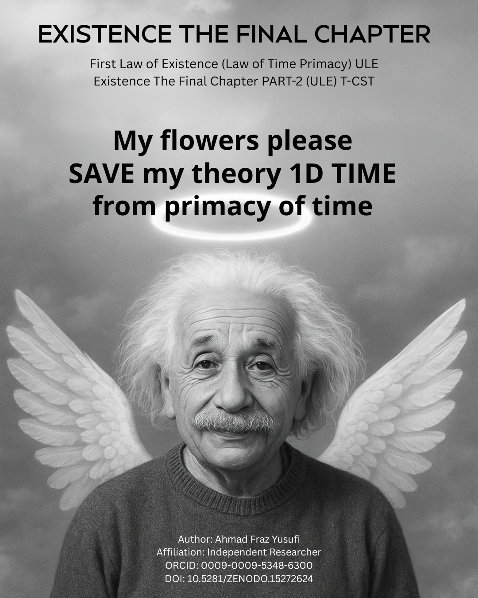

# T-CST: Tensor-Coupled Space-Time Cosmology



**T-CST (Tensor-Coupled Space-Time)** is an innovative cosmological framework that introduces a **3-dimensional structure of time**. In this paradigm, **time is the fundamental element of existence**, and space emerges as a function of time:


This repository implements the **first tensor-based simulation of T-CST**, enabling researchers to model the evolution of the universe, Hubble expansion, and gravitational wave-like metric perturbations arising from τ-particle dynamics.

---

## 🔑 Key Features

### 1. Cosmological Simulation
- Solves the **T-CST continuity equation** with τ-particle perturbations.  
- Computes the **scale factor**, **energy density**, and **Hubble parameter** as functions of time.  
- Generates **GW-like metric perturbations**, providing predictions for future gravitational wave observations.  

### 2. MCMC Parameter Fitting
- Fits **mock BAO** (Baryon Acoustic Oscillation) and **Pantheon+ supernovae** datasets.  
- Uses `emcee` ensemble sampling for posterior distributions of T-CST parameters.  
- Produces **corner plots** to visualize parameter constraints.

### 3. Visualization Tools
- Plot **Hubble expansion H(z)** and **metric perturbations** across redshifts.  
- Modular plotting scripts for easy extension to real observational datasets.  

### 4. Reproducibility & Modularity
- Organized Python scripts under `src/` for simulation, MCMC fitting, and visualization.  
- Placeholder datasets included in `data/` to run simulations immediately.  
- Jupyter notebooks support step-by-step experimentation and analysis.

---

## 🧩 Installation

Clone the repository:

```bash
git clone https://github.com/frazyusufi/T-CST.git
cd T-CST
pip install -r requirements.txt
from src.tcst_simulation import run_simulation

t, z, rho, a, H, h = run_simulation()
from src.tcst_mcmc import run_mcmc_fit

samples, best_fit = run_mcmc_fit()
from src.tcst_mcmc import run_mcmc_fit

samples, best_fit = run_mcmc_fit()
from src.tcst_visualization import plot_hubble, plot_gw, plot_corner

plot_hubble(z, H)
plot_gw(z, h)
plot_corner(samples)
T-CST/
├── data/                 # Placeholder mock datasets (BAO & SNe)
├── src/                  # Python modules for simulation, MCMC, visualization
├── results/              # Generated figures and output files
├── docs/                 # Documentation and illustrations
├── README.md             # Detailed description and instructions
├── LICENSE               # MIT License
└── requirements.txt      # Python dependencies
